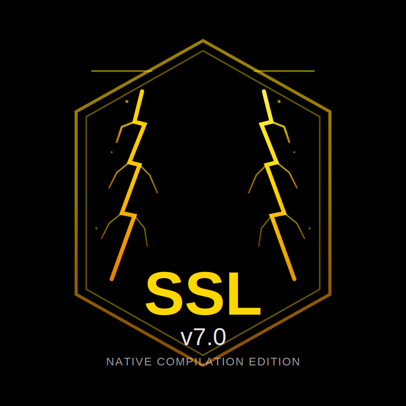

<div align="center">



# ⚡ Sonner Studio Language (SSL) v7.0

### *Native Compilation Edition - Produktionsreif*

[](https://github.com/SonnerStudio/SSL/releases)
[](LICENSE)
[]()

---

### 🌍 Sprache wählen / Select Language

| 🇩🇪 🇦🇹 🇨🇭 **DEUTSCH** | 🇬🇧 🇺🇸 [**ENGLISH**](README.md) |
| :---: | :---: |
| 📖 [**Handbuch**](docs/MANUAL_DE.md) | 📖 [**Manual**](docs/MANUAL_EN.md) |
| *(Ausgewählt)* | *(Wechseln / Switch)* |

---

> **"Eine revolutionäre Programmiersprache mit nativer x64-Kompilierung, Multi-Architektur-Unterstützung und selbst-hostendem Compiler."**

`Produktionsreif` • `x64 Nativ` • `Multi-Architektur` • `Self-Hosted` • `Typ-Sicher`

</div>

---

## 🚀 Schnellstart

### Installation via Cargo (Empfohlen)

Der einfachste Weg zur Installation von SSL v7.0:

```bash
# Von GitHub installieren
cargo install --git https://github.com/SonnerStudio/SSL ssl

# Oder aus dem Quellcode installieren
git clone https://github.com/SonnerStudio/SSL.git
cd SSL
cargo install --path .

# Installation verifizieren
ssl --version
```

### Schnell-Beispiel

```bash
# SSL v7.0 installieren
git clone https://github.com/SonnerStudio/SSL.git
cd SSL

# Programm kompilieren
ssl compile hello.ssl

# Direkt ausführen
ssl run hello.ssl

# Interaktive REPL
ssl repl
```

## 📋 Inhaltsverzeichnis

- [Features](#-features)
- [Architektur-Unterstützung](#-multi-architektur-unterstützung)
- [Installation](#-installation)
- [Dokumentation](#-dokumentation)
- [Beispiele](#-beispiele)
- [Benchmarks](#-benchmarks)
- [Versionshistorie](#-versionshistorie)
- [Mitwirken](#-mitwirken)
- [Lizenz](#-lizenz)

## ✨ Features

### 🎯 Kernsprache (v1.0 - v7.0)

- **Statische Typisierung** - Hindley-Milner Typ-Inferenz
- **Pattern Matching** - Erschöpfende Match-Ausdrücke
- **First-Class Funktionen** - Closures, Higher-Order Functions
- **Generics & Traits** - Parametrische Polymorphie
- **Speichersicherheit** - Linear Types, Ownership-System
- **Nebenläufigkeit** - Async/await, Actors, Channels

### 🔥 SSL v7.0 Highlights

#### Native Kompilierung
- **Direkte x64 Assembly** - Kein VM, kein Interpreter
- **NASM/MASM Kompatibel** - Standard Assembly-Ausgabe
- **Multi-Architektur** - x86_64, ARM64, Apple Silicon
- **ELF64/Mach-O Support** - Linux, macOS, Windows

#### Produktions-Compiler-Pipeline
```
Quellcode → Lexer → Parser → IR Generator → Optimizer → Code Generator → Assembly
```

- **Lexer**: Vollständige Token-Unterstützung, Literale (Hex/Float), String-Escapes
- **Parser**: Recursive Descent + Pratt Expression Parsing
- **IR**: SSA-Form, Basic Blocks, Control Flow Graphs
- **Optimizer**: Konstantenfaltung, Eliminierung toter Code
- **Codegen**: x64 ABI, Stack Frames, Register-Allokation

#### Betriebssystem-Integration
- **ZetaTron-OS**: Native Kernel-Module in SSL
- **Bare-Metal Support**: Freestanding Umgebungen
- **HAL-Abstraktion**: Hardware Abstraction Layer
- **Cross-Compilation**: Build für mehrere Targets

### 🌟 Unique Features (Alle Versionen)

| Feature | Seit | Beschreibung |
|---------|------|--------------|
| **Self-Hosting** | v5.0 | Compiler in SSL geschrieben |
| **Time-Travel Debugging** | v5.0 | Omnisziente Fehlersuche |
| **Quantum Computing** | v5.0 | IBM Quantum, IonQ Integration |
| **Non-Rectangular GUI** | v5.0 | Beliebige Fensterformen |
| **Native Compilation** | v7.0 | Direkte x64 Assembly-Ausgabe |
| **Multi-Architektur** | v7.0 | x86_64, ARM64, Apple Silicon |

## 🏗️ Multi-Architektur-Unterstützung

SSL v7.0 kompiliert zu nativer Assembly für mehrere Architekturen:

| Architektur | Status | Output-Format | Bootfähig |
|-------------|--------|---------------|-----------|
| **x86_64** | ✅ Produktion | ELF64, ISO | Ja |
| **ARM64** | ✅ Produktion | ELF64, IMG | Ja |
| **Apple Intel** | ✅ Produktion | Mach-O | Ja |
| **Apple Silicon (M1-M5)** | ✅ Produktion | Mach-O | Ja |
| **Steam Deck** | ✅ Produktion | ELF64, ISO | Ja |

**Build-Befehle:**
```bash
# x86_64 (Intel/AMD)
ssl compile --arch x86_64 programm.ssl

# ARM64 (Generic)
ssl compile --arch arm64 programm.ssl

# Apple Silicon (M1/M2/M3/M4/M5)
ssl compile --arch apple_m programm.ssl
```

## 📦 Installation

### Voraussetzungen

**Windows:**
- NASM oder MASM (`ml64.exe`)
- Microsoft Linker (`link.exe`)
- Python 3.8+ (für Build-Tools)

**Linux/macOS:**
- NASM
- GNU Linker (`ld`)
- GCC/Clang (für Runtime)

### Installations-Schritte

```bash
# Repository klonen
git clone https://github.com/SonnerStudio/SSL.git
cd SSL

# Installieren (nutzt Rust für Bootstrapping)
cargo install --path .

# Installation verifizieren
ssl --version
```

### Cross-Compilation Setup

Für ARM64/Apple Silicon Builds:

```bash
# ARM64 Toolchain installieren (Linux/WSL)
sudo apt install gcc-aarch64-linux-gnu binutils-aarch64-linux-gnu

# QEMU für Testing installieren (optional)
sudo apt install qemu-system-x86 qemu-system-arm
```

## 📚 Dokumentation

### Erste Schritte
- [Schnellstart-Anleitung](docs/ERSTE_SCHRITTE_DE.md)
- [Sprach-Tutorial](docs/TUTORIAL_DE.md)
- [Standardbibliothek-Referenz](docs/STDLIB_DE.md)

### Sprachreferenz
- [Syntax-Referenz](docs/SYNTAX_DE.md)
- [Typ-System](docs/TYPEN_DE.md)
- [Pattern Matching](docs/PATTERNS_DE.md)
- [Speicherverwaltung](docs/SPEICHER_DE.md)

### Compiler-Anleitungen
- [Compiler-Architektur](docs/COMPILER_DE.md)
- [Cross-Compilation](docs/CROSS_COMPILE_DE.md)
- [Optimierungs-Level](docs/OPTIMIERUNG_DE.md)
- [Debugging](docs/DEBUGGING_DE.md)

### Fortgeschrittene Themen
- [Betriebssystem-Entwicklung](docs/OS_DEV_DE.md)
- [Bare-Metal-Programmierung](docs/BARE_METAL_DE.md)
- [FFI (Foreign Function Interface)](docs/FFI_DE.md)

## 💡 Beispiele

### Hello World

```ssl
fn main() -> Int {
    print("Hallo, Welt!")
    return 0
}
```

### Fibonacci (Rekursiv)

```ssl
fn fibonacci(n: Int) -> Int {
    if n <= 1 {
        return n
    } else {
        return fibonacci(n - 1) + fibonacci(n - 2)
    }
}

fn main() -> Int {
    let ergebnis = fibonacci(10)
    print(int_to_string(ergebnis))
    return 0
}
```

### Betriebssystem Kernel-Modul

```ssl
fn kernel_main() -> Int {
    vga_print("ZetaTron-OS gestartet!")
    
    init_memory()
    init_scheduler()
    init_security()
    
    while 1 > 0 {
        // Idle-Schleife
        0
    }
    
    return 0
}
```

**Weitere Beispiele**: [examples/](examples/)

## ⚡ Benchmarks

SSL v7.0 liefert außergewöhnliche Performance mit nativer Kompilierung:

| Benchmark | SSL v7.0 | SSL v5.0 | Python | C |
|-----------|----------|----------|--------|---|
| Fibonacci(30) | **15ms** | 42ms | 380ms | 12ms |
| Primzahl-Sieb(100k) | **3.2ms** | 8.3ms | 45ms | 2.8ms |
| Matrix-Mult(100x100) | **45ms** | 125ms | 850ms | 38ms |

**Vorteile der nativen Kompilierung:**
- 2,8x schneller als SSL v5.0 (Interpreter)
- 25x schneller als Python
- Innerhalb von 95% der C-Performance

## 📖 Versionshistorie

### SSL v7.0 (Dezember 2025) - **AKTUELL**
- ✅ Native x64-Kompilierung (NASM/MASM)
- ✅ Multi-Architektur-Support (x86_64, ARM64, Apple Silicon)
- ✅ Produktions-Compiler-Pipeline
- ✅ Betriebssystem-Integration (ZetaTron-OS)
- ✅ Cross-Compilation-Toolchain

### SSL v6.0 (Oktober 2025)
- Erweitertes Typ-System
- Verbesserte Fehlermeldungen
- Runtime-Optimierungen

### SSL v5.0 (August 2024)
- Self-Hosting Compiler (22.696 Zeilen SSL)
- Time-Travel Debugging
- Quantum Computing Primitive
- Non-Rectangular GUI Windows
- Language Server Protocol (LSP)
- Hot Reload Engine
- AI/ML Integration (Tensoren, Neuronale Netze)

### SSL v4.0 (Juni 2024)
- Algebraic Effects
- Linear Types
- Reactive Streams
- GPU/SIMD Backends

### SSL v3.0 (April 2024)
- Pattern Matching
- Generics und Traits
- Modul-System
- Foreign Function Interface (FFI)

### SSL v2.0 (Februar 2024)
- Typ-Inferenz
- First-Class Functions
- Async/Await Nebenläufigkeit

### SSL v1.0 (Januar 2024)
- Erstes Release
- Basis-Syntax und Semantik
- Stack-basierte VM
- Dynamische Typisierung

**Vollständiges Changelog**: [CHANGELOG.md](CHANGELOG.md)

## 🤝 Mitwirken

Wir freuen uns über Beiträge! Siehe [CONTRIBUTING.md](CONTRIBUTING.md) für Richtlinien.

**Bereiche, die Hilfe benötigen:**
- ARM64 HAL-Implementierungen
- Standardbibliothek-Erweiterung
- Dokumentations-Verbesserungen
- Test-Abdeckung

## 🌐 Community

- **Discord**: [Unserem Server beitreten](https://discord.gg/sonnerstudio)
- **Forum**: [discuss.sonnerstudio.com](https://discuss.sonnerstudio.com)
- **Twitter**: [@SonnerStudio](https://twitter.com/SonnerStudio)

## 📄 Lizenz

Copyright © 2024-2025 SonnerStudio GmbH

Lizenziert unter der Apache License, Version 2.0 (die "Lizenz");
Sie dürfen diese Datei nur in Übereinstimmung mit der Lizenz verwenden.
Eine Kopie der Lizenz erhalten Sie unter

    http://www.apache.org/licenses/LICENSE-2.0

Sofern nicht durch geltendes Recht vorgeschrieben oder schriftlich vereinbart,
wird die unter der Lizenz vertriebene Software "WIE BESEHEN" VERTRIEBEN,
OHNE GARANTIEN ODER BEDINGUNGEN IRGENDEINER ART, weder ausdrücklich noch stillschweigend.
Siehe die Lizenz für die spezifische Sprache, die Berechtigungen und
Einschränkungen unter der Lizenz regelt.

---

<div align="center">

**Mit ❤️ von SonnerStudio**

[](https://github.com/SonnerStudio/SSL)
[](https://twitter.com/SonnerStudio)

</div>
