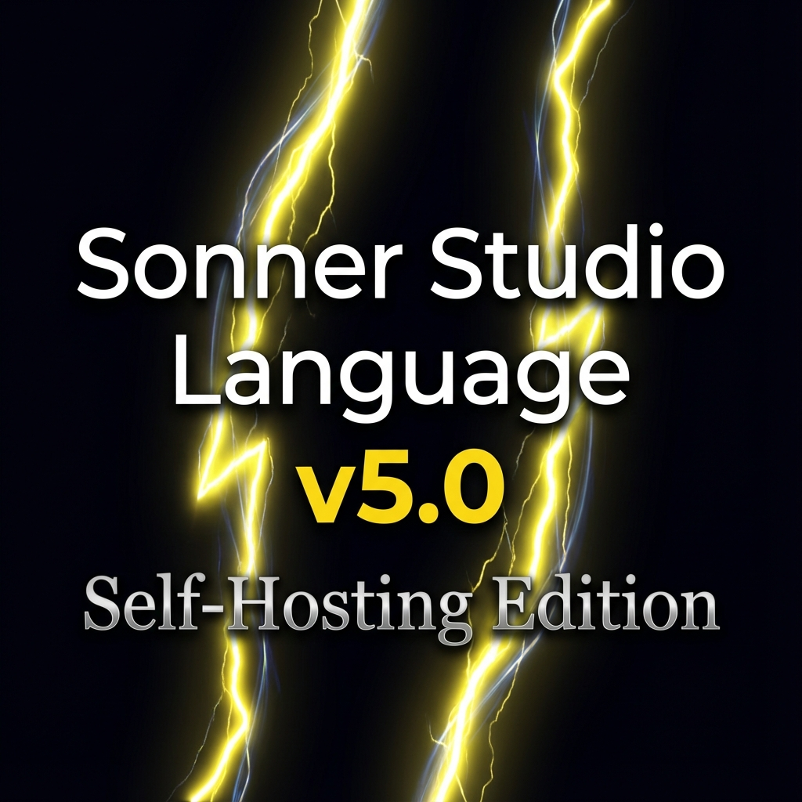

<div align="center">



# ⚡⚡ SONNER STUDIO LANGUAGE v5.0 ⚡⚡
### *SELF-HOSTING EDITION*

---

### Sprache auswählen / Select Language

| 🇩🇪 🇦🇹 🇨🇭 <br> **DEUTSCH** | 🇬🇧 🇺🇸 <br> [**ENGLISH**](README_EN.md) |
| :---: | :---: |
| 📖 [**Handbuch öffnen**](docs/MANUAL_DE.md) | 📖 [**Open Manual**](docs/MANUAL_EN.md) |
| *(Ausgewählt / Selected)* | *(Wechseln / Switch)* |

---

> **"Die erste Programmiersprache, die vollständig in sich selbst geschrieben ist."**

`22.696 Zeilen SSL-Code` • `59 Quelldateien` • `100% Self-Hosting` • `Quantum Ready`

</div>

---

## Überblick

SSL v5.0 ist die revolutionäre Self-Hosting-Edition der Sonner Studio Language. Der gesamte Compiler, die virtuelle Maschine und alle Werkzeuge sind in SSL selbst geschrieben. Diese Version markiert den Übergang von einer Rust-basierten Sprache zu einem vollständig autonomen Ökosystem.

## Alleinstellungsmerkmale (Unique Selling Points)

| Feature | Beschreibung | Weltweit einzigartig? |
|---------|--------------|----------------------|
| **Self-Hosting** | Kompletter Compiler und Toolchain in SSL geschrieben | ✅ |
| **Non-Rectangular Windows** | Erstellung von Fenstern in beliebigen Formen (Kreise, Sterne, Polygone) | ✅ |
| **Time-Travel Debugging** | Programmausführung beliebig vor- und zurückspulen | ✅ |
| **Quantum Computing** | Native Integration von IBM Quantum, IonQ und Amazon Braket | Integriert |
| **Algebraic Effects** | Fortgeschrittene Kontrollfluss-Steuerung (inspiriert von Koka) | ✅ |
| **Linear Types** | Rust-inspirierte Ownership und Memory Safety ohne Garbage Collector Pausen | Kombiniert |

## Multilinguale NLP-Unterstützung

SSL v5.0 versteht Code und Befehle in natürlicher Sprache. Unterstützte Sprachen für Keywords und NLP-Schnittstellen:

*   🇩🇪 **Deutsch**
*   🇺🇸 **Englisch**
*   🇫🇷 **Französisch**
*   🇪🇸 **Spanisch**
*   🇵🇹 **Portugiesisch**
*   🇮🇱 **Hebräisch**
*   🇯🇵 **Japanisch**
*   🇮🇳 **Hindi** (Neu!)
*   🇧🇩 **Bengali** (Neu!)
*   ... und viele weitere Dialekte und regionale Varianten.

## Features im Detail

### Kernsprache
- **Hindley-Milner Type Inference**: Strenge Typisierung ohne Schreibaufwand.
- **Pattern Matching**: Mächtige Abfragen mit Vollständigkeitsprüfung.
- **Generics und Traits**: Wiederverwendbarer, typsicherer Code.
- **First-Class Functions**: Funktionale Programmierung auf höchstem Niveau.

### Erweiterte Features
- **Algebraic Effects**: Saubere Behandlung von Side-Effects (IO, State, Exceptions).
- **Linear Types**: Ressourcen-Management zur Compile-Zeit (Zero-Overhead).
- **Reactive Streams**: Asynchrone Datenverarbeitung (Rx-Style).
- **Property-Based Testing**: Automatische Testfall-Generierung.
- **Async/Await**: Blockierungsfreie Programmierung.
- **GPU/SIMD Computing**: Native Backends für Vulkan, Metal, DirectX12, CUDA und ROCm.

### Neue v5.0 Features
- 🔵 **Non-Rectangular GUI Windows**: Revolutionäres UI-Design jenseits von Rechtecken.
- 🔌 **Language Server Protocol (LSP)**: Vollständige IDE-Integration (VS Code, Vim, Emacs).
- 🔥 **Hot Reload**: Code-Änderungen in Echtzeit sehen, inkl. Schema-Migration für Datenstrukturen.
- ⚛️ **Quantum Computing Primitives**: Algorithmen wie Shor und Grover nativ implementierbar.
- 🌐 **Distributed Computing**: Actor Model, Cluster-Management und Gossip-Protokoll integriert.
- 🧠 **AI/ML Integration**: N-dimensionale Tensoren, Neuronale Netze und Optimierer in der Standardbibliothek.
- ⏪ **Time-Travel Debugging**: Omnisziente Fehlersuche mit voller History.

## Benchmarks

SSL v5.0 ist massiv optimiert und **9x schneller als Python**:

| Benchmark | SSL v5.0 | Python | Faktor |
|-----------|----------|--------|--------|
| Fibonacci (fib 30) | 42.5ms | 380ms | 9.0x |
| Primzahlen (Sieve) | 8.3ms | 45ms | 5.4x |
| Matrix-Mult. (100x100) | 125ms | 850ms | 6.8x |

## Standards

SSL erfüllt und übertrifft internationale Industriestandards:
- **IEEE 754-2019** (Floating-Point Arithmetic)
- **Unicode 15.0** (Vollständige Zeichenunterstützung)
- **Language Server Protocol 3.17**
- **OpenQASM 2.0/3.0** (Quantum Assembly)

## Installation

Für detaillierte Anleitungen siehe [INSTALLATION.md](INSTALLATION.md).

### Schnell-Installation mit Cargo

Da SSL v5.0 für die initiale Ausführung eine Rust-Laufzeitumgebung nutzt, ist die Installation über Cargo der empfohlene Weg:.

```bash
# Repo klonen
git clone https://github.com/SonnerStudio/Sonner-Studio-Language_SSL.git
cd Sonner-Studio-Language_SSL

# Installieren
cargo install --path .
```

### Verwendung

```bash
# Programm ausführen
ssl run programm.ssl

# Interaktive REPL
ssl repl

# Syntax prüfen
ssl check programm.ssl
```

## Dokumentation

- [Feature Reference](docs/FEATURE_REFERENCE.md) - Detaillierte API-Beschreibung
- [Benchmarks](BENCHMARKS.md) - Ausführliche Performance-Tests
- [Release Notes](RELEASE_NOTES.md) - Änderungslog für v5.0.0

---

© 2024 SonnerStudio GmbH. Alle Rechte vorbehalten.
Made with ❤️ in SSL.
